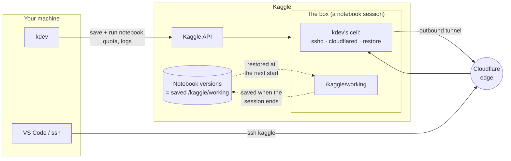
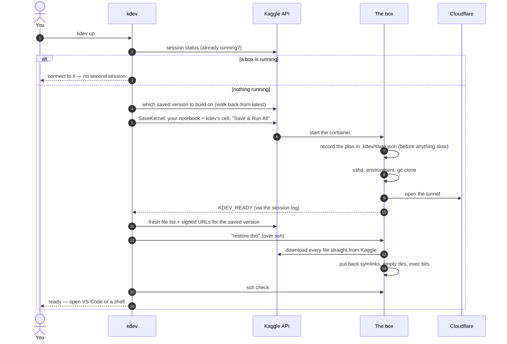
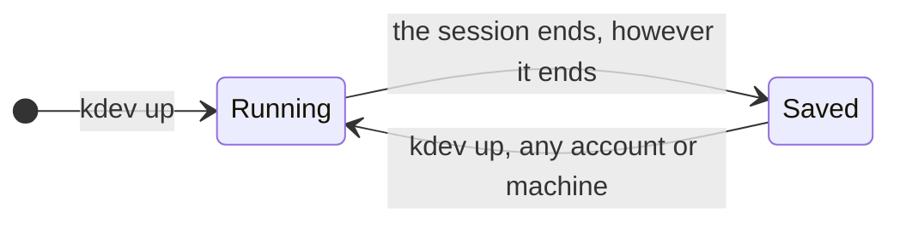
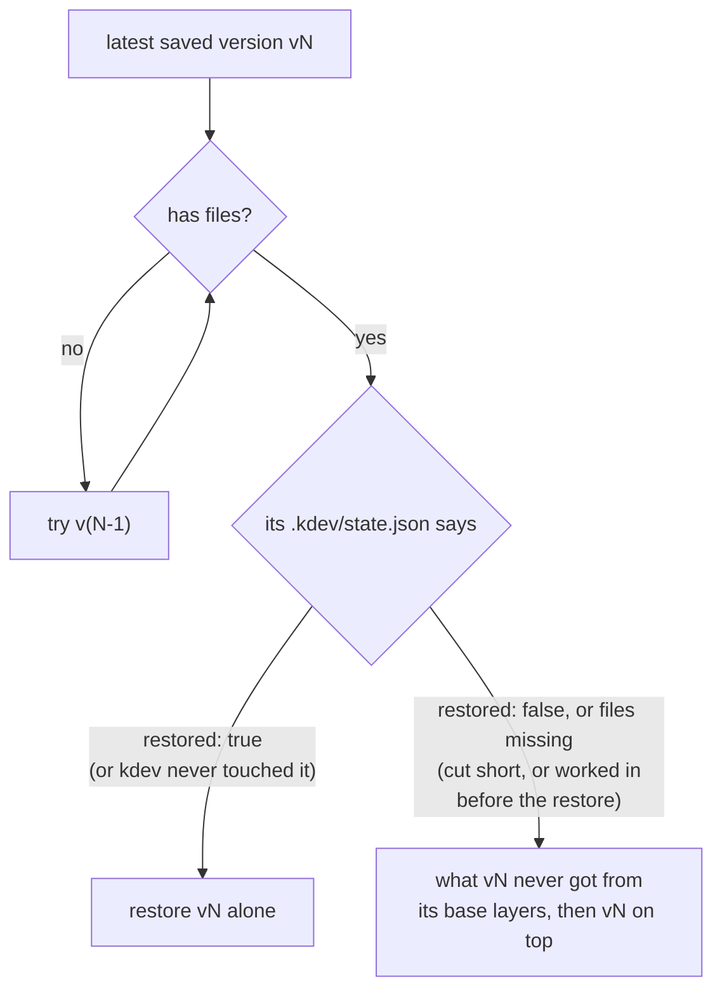
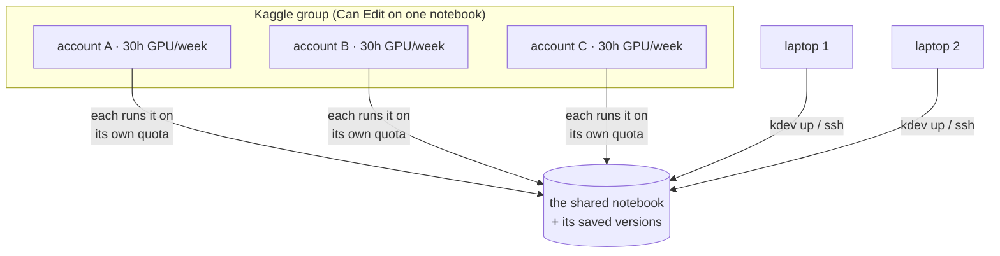
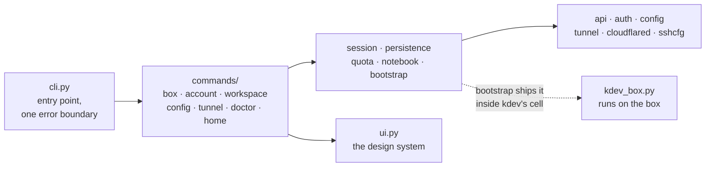

<p align="center">
  
</p>

<p align="center">
  <b>A Kaggle notebook as your remote dev box.</b><br>
  Start it with one command, work in it from VS Code or a shell, and leave whenever you like.<br>
  Your files are there next time — on any account in your Kaggle group, from any machine.
</p>

<p align="center">
  <a href="https://github.com/tushar-mahalya/kdev/actions/workflows/ci.yml"></a>
  <a href="https://pypi.org/project/kdev-cli/"></a>
  <a href="https://pypi.org/project/kdev-cli/"></a>
  <a href="https://github.com/tushar-mahalya/kdev/blob/main/LICENSE"></a>
  <a href="https://scorecard.dev/viewer/?uri=github.com/tushar-mahalya/kdev"></a>
  <a href="#contributing"></a>
</p>

<p align="center">
  <a href="#install-and-set-up">Install</a> ·
  <a href="#everyday-use">Everyday use</a> ·
  <a href="#your-files">Your files</a> ·
  <a href="#commands">Commands</a> ·
  <a href="#troubleshooting">Troubleshooting</a> ·
  <a href="#contributing">Contributing</a>
</p>

<br>

```bash
kdev setup      # once per machine
kdev up         # start the box (or connect to the one that is running)
ssh kaggle      # or VS Code → Remote-SSH → kaggle
kdev down       # optional: stop early and hand the quota back
```

- **One box, pooled quota.** Every account in your group runs the same shared
  notebook on its own 30 GPU-hours a week. When one runs short, `kdev up` asks
  which account takes over.
- **Files that persist.** Whatever is in `/kaggle/working` when a session ends
  comes back at the next start, however it ended: `kdev down`, the Kaggle UI,
  a timeout, a crash, your wifi dropping.
- **A real server.** A stable hostname over Cloudflare Tunnel, public-key SSH,
  your notebook's full environment (CUDA, Python, Kaggle variables) in every
  session, interactive or not.

---

## Contents

- [How it works](#how-it-works)
- [Install and set up](#install-and-set-up)
- [Everyday use](#everyday-use)
- [Your files](#your-files)
- [Several accounts, several machines](#several-accounts-several-machines)
- [Commands](#commands)
- [Settings](#settings)
- [Troubleshooting](#troubleshooting)
- [Security and limits](#security-and-limits)
- [Contributing](#contributing)

---

## How it works

Kaggle's API can save a notebook and run it, but it has no "give me a shell"
call. kdev writes a small cell at the top of your notebook. When Kaggle runs
that cell, it turns the container into an SSH server and connects it to your
Cloudflare tunnel. Your laptop then reaches it by name.



Nothing listens on a public port: the box dials *out* to Cloudflare, and your
`ssh` reaches it through Cloudflare by hostname.

### What `kdev up` does



The board you watch while this happens shows each step's own clock, so a slow
queue looks like a queue and not a hang:

```
  alice · T4 ×2 · 9h                    1m52s
   ✓ Submitting                                     1s
   ✓ Waiting for a machine                       1m21s
   ✓ Installing SSH server                         14s
   ✓ Exporting notebook environment                 0s
   ✓ Syncing workspace                              0s
   ✓ Starting Cloudflare tunnel                     4s
   ⠹ Restoring your files                           9s
     812/1505 files
   ○ Ready
```

---

## Install and set up

<a href="https://pypi.org/project/kdev-cli/"></a>
<a href="https://pypi.org/project/kdev-cli/"></a>
<a href="https://github.com/tushar-mahalya/kdev/releases/latest"></a>

Needs Python 3.11+, `ssh`, and a Kaggle account in a Kaggle group.

```bash
uv tool install kdev-cli      # or: pipx install kdev-cli
kdev setup
```

The package is `kdev-cli` (PyPI does not allow `kdev`); the command it installs
is `kdev`. Upgrade with `uv tool upgrade kdev-cli`.

To run what is on `main` but not released yet:
`uv tool install git+https://github.com/tushar-mahalya/kdev`.

`kdev setup` does only what is missing, so it is safe to run again at any
time. It will:

1. find (or create) your SSH key;
2. fetch Cloudflare's `cloudflared` if you don't have it — a system install
   (`brew install cloudflared`) always wins;
3. sign a Kaggle account in, through your browser (OAuth);
4. join your group's workspace notebook, or create one;
5. set up the tunnel — **skipped on a second machine**, which takes the tunnel
   from the notebook itself.

### The tunnel

With a domain on Cloudflare (free plan, domain showing *Active*):

```bash
kdev tunnel setup     # opens a browser once to authorise your Cloudflare account
```

It creates the tunnel and its DNS record, and stores the credentials. There's
nothing to configure in the Zero Trust dashboard. Re-running it is a no-op; it
never repoints a hostname that belongs to something else without asking.

|  | Named tunnel (your domain) | Quick tunnel (no domain) |
|---|---|---|
| Setup | once, ~2 minutes | none |
| Hostname | the same forever | new every session |
| After a network drop | same name, `ssh` just reconnects | new name; `kdev up` finds it |
| Speed | identical | identical |

### The workspace

A Kaggle group can't own anything, so one account owns the notebook and shares
it with the group as **Can Edit**:

```bash
kdev workspace create --group <your-group-slug>   # the owner, once
kdev workspace join                               # everyone else
```

---

## Everyday use

```bash
kdev                  # overview: the box, every account's quota, what to do next
kdev up               # start the box, or connect to the one already running
kdev status           # running? who started it? when does it end? files back?
kdev down             # stop it now
```

Bare `kdev` in a terminal ends with a menu of the actions that make sense
right now: connect or stop when the box is up; start it, or switch account,
when it isn't.

The box you start is a setting — pick once, and `kdev up` stops asking:

```bash
kdev config set gpu t4
kdev config set hours 9
```

**Leaving needs no ceremony.** Close the laptop, lose the wifi, walk away.
The box runs to the end of its session and saves as it stops. `kdev down` is
for stopping *early*, to hand the quota back.

---

## Your files

`/kaggle/working` behaves like a disk that is always there.

**Kaggle saves it.** When a "Save & Run All" session ends, Kaggle keeps
`/kaggle/working` as that version's output — and it does so however the
session ends. A clean exit, a crash and a cancel were all measured to save
every file up to the moment the container stopped. Older versions stay
readable (`v1`, `v2`, …), and they belong to the **notebook**, not to an account.

**kdev puts it back.** Kaggle starts every batch session with an empty
`/kaggle/working`; its "Persistence" setting only covers the web editor. So
each `kdev up` works out which saved version you left off at, and the new box
downloads it before you connect.



| how the last session ended | what the next `kdev up` gives you |
|---|---|
| `kdev down` | everything |
| `kdev down`, then `kdev up` straight away | everything: `up` waits for the save first (about 2 min per GB) |
| **Stop session** in the Kaggle UI | everything (a cancel still saves) |
| the session's time ran out | everything (the box stops itself 2 min early) |
| the tunnel process died | everything |
| the box crashed | everything, up to the crash |
| your laptop or network dropped | the box is still running: `kdev up` connects to it |
| Kaggle's machine itself failed | not testable; a git remote covers it |

### What kdev adds on top of Kaggle

Kaggle's saved output keeps every regular file — thousands of them, dotfiles,
`.git`, large binaries. It **drops symlinks and empty directories, and loses
executable bits**, which would break a Python virtualenv. The box records
those in `.kdev/meta.json` every 30 seconds, and the restore puts them back.

### Picking the version to restore



A version with no files is a source-only save (group setup, a Quick Save), so
kdev walks past it. A session that was stopped before its restore finished —
or that you worked in before restoring — is not skipped: it gets stacked on
the versions it was meant to be built on, so nothing done in it is lost. The
layers underneath fill in only what that session's restore never delivered
(the box logs each file as it lands, in `.kdev/fetched`), so a file you deleted
there stays deleted.

A restore never overwrites a file written in the current session, so it is
safe to run again at any time:

```bash
kdev restore               # finish or repeat the restore on the running box
kdev restore --from v12    # add files v12 has that the box doesn't (not a rollback)
kdev workspace files       # what `kdev up` would restore (--version v12 for another)
kdev backup                # optional: an exact copy of the box on this machine
```

### Your own cells in the notebook

kdev's cell sits on top, and **nothing below it runs**. When a session ends,
later cells are blanked for that run, so a training cell can't start after
`kdev down` and use quota. Your cells stay in the notebook, untouched.

### Files made in the Kaggle web editor

The editor's interactive session is the one place kdev can't reach: its files
only reach the API when a version is saved. Kaggle describes Quick Save as
saving the notebook "as displayed", which isn't a clear promise to save the
working directory, so check with `kdev workspace files`. Everything made
through kdev is covered.

---

## Several accounts, several machines



- **Quota is per account.** A session is charged to the account that starts
  it, not to the notebook's owner (measured).
- **Switching is a question, not a wall.** If the active account can't finish
  the session you asked for, `kdev up` shows every account's remaining hours
  and lets you pick. `kdev account use <name>` switches by hand.
- **The box is still running?** `kdev up` from any account or machine
  connects to it instead of starting a second one.
- **A new laptop.** `kdev setup` signs you in and joins the workspace. The
  tunnel and git settings come from the notebook, and the new laptop's SSH
  key is saved in the workspace (`.kdev/authorized_keys`). So every machine
  that has used it can reach every later box.
- **Stopping a box someone else started.** Kaggle only lets the account that
  started a session cancel it. When the box doesn't answer, `kdev down` finds
  out which account that was and cancels as it — or tells you which account
  has to.

```bash
kdev account add alice    # sign an account in (browser); re-run to refresh it
kdev account              # every account and its GPU/TPU hours left
kdev account use alice    # it runs the next box
```

---

## Commands

| command | what it does |
|---|---|
| `kdev` | overview of the box, accounts and workspace; in a terminal, the next actions |
| `kdev setup` | get this machine ready; only does what is missing |
| `kdev up` | start the box, or connect to the running one |
| `kdev down` | stop the box; files are saved however it stops |
| `kdev ssh [-- ARGS]` | shell on the box; ssh's exit code is kdev's |
| `kdev status [--json]` | running?, started by, ends at, reachable, restore state |
| `kdev logs [-n N] [--all]` | the session log |
| `kdev restore [--from vN \| --from-backup]` | put saved files back |
| `kdev backup` | copy the running box to this machine |
| `kdev account [--json]` | accounts and quota |
| `kdev account add \| use \| remove` | manage accounts |
| `kdev workspace` | the notebook: owner, sharing, members, saved versions |
| `kdev workspace files [--version vN] [--json]` | what a saved version holds |
| `kdev workspace join \| use \| create \| share` | choose, make, or re-share the notebook |
| `kdev config` / `set KEY VALUE` / `unset KEY` | settings |
| `kdev tunnel` / `tunnel setup` | the Cloudflare tunnel |
| `kdev doctor [--fix]` | check everything; exits 1 if something is broken |

Useful flags on `kdev up`: `--gpu none|t4|p100|tpu`, `--hours N`,
`--account NAME`, `--open code|shell|none`, `--no-restore`, `--replace`, `-y`.

Global: `-v` logs every Kaggle API call with its status and timing;
`--version`; `--install-completion` for shell completion.

**Exit codes:** `0` success · `1` failed (the message says why and what to
run) · `2` usage mistake · `130` cancelled.

**Scripting:** every prompt has a flag, and a prompt never appears without a
terminal. `status`, `account` and `workspace files` take `--json` (data on
stdout, errors on stderr). `NO_COLOR` is honoured.

---

## Settings

`kdev config` lists them; secrets are never shown.

| setting | meaning |
|---|---|
| `gpu` | accelerator for `kdev up`: `none`, `t4`, `p100`, `tpu` (and `l4`, `a100`, `h100` where your account has them) |
| `hours` | session length for `kdev up` (Kaggle's limit: 12h, 9h on TPU) |
| `git-remote` | a repo cloned at boot, pushed every 15 minutes and at teardown |
| `git-deploy-key` | path to that repo's deploy key |
| `ssh-key` | path to this machine's public key |
| `ssh-alias` | the name in `~/.ssh/config` (default `kaggle`) |
| `tunnel-hostname` | the box's hostname |
| `tunnel-token` | a Cloudflare-dashboard tunnel token, instead of `kdev tunnel setup` |

Stored in `~/.config/kdev/config.json` (mode 0600). Move it with
`KDEV_CONFIG_DIR`.

---

## Troubleshooting

```bash
kdev doctor        # every dependency, account token, the workspace and the tunnel's DNS
kdev -v status     # the same command, with each Kaggle API call logged
kdev logs          # what the box itself is saying
```

| you see | what to do |
|---|---|
| `… is not signed in` | `kdev account add <name>` refreshes that account |
| `ssh does not answer` right after starting | give Cloudflare a minute; `kdev ssh` |
| `The session never reported a tunnel` | `kdev logs`; the message names the command to stop it |
| `Only X can cancel session …` | sign X in (`kdev account add`) or stop it in the Kaggle UI |
| `Not all your files are back yet` | `kdev restore` finishes it |
| `your last box is still saving your files` | nothing: `kdev up` waits, then starts |
| `… has a session kdev cannot reach` | someone is using the notebook in the Kaggle editor |

---

## Security and limits

- **Access** is public-key SSH only; password login is disabled. The box
  accepts every key saved in the workspace's `.kdev/authorized_keys`: remove a
  line there to revoke a machine.
- **Secrets in the notebook.** Kaggle has no API for notebook Secrets, so the
  tunnel credentials (and a git deploy key, if you set one) sit in the private
  notebook's source. Anyone with Can Edit can read them. Scope a deploy key to
  one repository.
- **Host keys.** Every session is a new container with a new host key, so the
  `kaggle` block in `~/.ssh/config` doesn't pin one; a pinned key would break
  VS Code on every other machine. Only a box holding the workspace's tunnel
  credentials can answer on that hostname, and anyone holding those can
  already edit the notebook that builds the box.
- **One box at a time.** kdev is built for one person on one machine at a
  time; switching machines is fine. Two machines running `kdev up` at the same
  moment start two boxes behind one hostname, and only the one that stops last
  carries forward. Start from one machine, then connect from the other.
- **Metadata in the last 30 s.** After a hard kill, symlinks, empty folders and
  executable bits created in the final 30 seconds are gone. File contents never
  are.
- **Nothing sensitive in crash reports.** kdev never prints tracebacks with
  local variables; `-v` shows a traceback when you ask for one.
- **Kaggle's limits:** 12h per CPU/GPU session and 9h on TPU; weekly GPU/TPU
  quota per account; 20 GB of `/kaggle/working` saved per version.
- **Kaggle's terms.** Kaggle allows one account per person, and restricts
  tunnelling out of notebooks; accounts have been banned for both. kdev does
  nothing to hide what it does. Know the rules you are working under.

---

## Contributing

Contributions are welcome — bug reports, fixes, docs and features alike. kdev
is small and opinionated, so for anything bigger than a fix, open an issue
first and say what you want to change and why. It saves you writing code that
goes a different way than the project.

### Ways to help

- **Ask a question** in [Discussions](https://github.com/tushar-mahalya/kdev/discussions):
  how to do something, or whether what you see is expected.
- **Report a bug.** Open an issue with what you ran, what you expected and
  what happened. The output of the same command with `-v` (`kdev -v up …`)
  helps most. It logs every Kaggle API call; check it for anything you would
  rather not share before you paste it.
- **Fix something.** Issues labelled
  [`good first issue`](https://github.com/tushar-mahalya/kdev/labels/good%20first%20issue)
  are small and well described; [`help wanted`](https://github.com/tushar-mahalya/kdev/labels/help%20wanted)
  ones are bigger. Say in the issue that you are on it, so two people don't
  fix the same thing.
- **Improve the docs.** If something here was unclear when you set up, it will
  be unclear to the next person too.
- **Report a vulnerability** privately, as [SECURITY.md](https://github.com/tushar-mahalya/kdev/blob/main/SECURITY.md)
  describes, never in a public issue.

### Set up

You need Python 3.11+ and [uv](https://docs.astral.sh/uv/).

```bash
git clone https://github.com/tushar-mahalya/kdev && cd kdev
uv sync
uv run pre-commit install        # hooks on commit, tests on push
uv run pytest                    # 199 tests, no network needed
uv run pytest --cov              # the same suite with a local coverage report
uv run kdev -v …                 # the working tree, with API logging
```

Every commit runs formatting, lint, a secrets scan (`detect-secrets`,
private-key detection), config validation and a lockfile check; every push
runs the tests. CI runs the same hooks, the tests on Python 3.11–3.13, a
build-and-install check, and `gitleaks` over the full history.

### Trying a change against real Kaggle

The test suite needs no Kaggle account, and most changes need nothing more.
When yours touches the box, the tunnel or the restore, try it for real:

- Use **your own** workspace (`kdev workspace create --group <slug>`), not a
  shared one someone else works in.
- Start **CPU boxes**: `uv run kdev up --gpu none --hours 1`. They cost no GPU
  quota. A GPU run spends the quota of whichever account starts it.
- `kdev down` when you are done, and `kdev workspace files` to see exactly
  what was saved.

### How the code is laid out



| layer | rule |
|---|---|
| `commands/` | parse arguments, call logic, render with `ui`; no API calls of their own beyond reads |
| `session`, `persistence`, `quota`, `notebook` | the behaviour; testable without a terminal |
| `kdev_box.py` | standard library only; it's shipped into the container and runs there |
| `ui.py` | every visual element, with its tokens and rules written down at the top |
| `errors.KdevError` | every failure a user can act on: a message and the command that fixes it |

Tests are split by module. `tests/test_cli.py` runs every command through
the real entry point against a fake Kaggle. `tests/test_kdev_box.py` runs the
on-box restore against a temporary directory.

### Pull requests

- **One change per pull request**, with a description of the problem it
  solves and how you checked it.
- **A bug fix comes with a test** that fails without the fix. New behaviour
  comes with the smallest test that would catch it breaking. Tests stay
  offline: use the fake Kaggle in `tests/test_cli.py`.
- **Match the code around you.** `kdev_box.py` stays standard-library only.
  Everything the user sees goes through `ui.py`. A failure the user can act on
  is a `KdevError` with the command that fixes it.
- **Commit messages** follow [Conventional Commits](https://www.conventionalcommits.org/)
  (`fix:`, `feat:`, `docs:`, `test:`, `ci:`, `refactor:`), with the *why* in
  the body.
- **Record what users will notice** under `## [Unreleased]` in
  [CHANGELOG.md](https://github.com/tushar-mahalya/kdev/blob/main/CHANGELOG.md), and update this README if a command or its
  behaviour changes.

### Releasing

For maintainers: bump `version` in `pyproject.toml`, move the `Unreleased`
notes in `CHANGELOG.md` under the new version, then
`git tag vX.Y.Z && git push origin vX.Y.Z`. The release workflow checks that
the tag matches the version, runs the tests, and publishes a GitHub release
with the wheel and sdist attached.

### License

kdev is [MIT licensed](https://github.com/tushar-mahalya/kdev/blob/main/LICENSE). By contributing, you agree that your
contributions are licensed under the same terms.
